# 🌦️ Will it rain tomorrow? Missing-Data Analysis & Rain Prediction on Australian Weather Data

An end-to-end machine learning project on the *Rain in Australia* dataset: **145,460 daily observations from 49 weather stations (2007 to mid-2017)**. Real-world sensor data has large, uneven gaps, so this project first diagnoses *where and when* data is missing, then cleans it, then builds and honestly evaluates models that predict whether it will rain the next day.

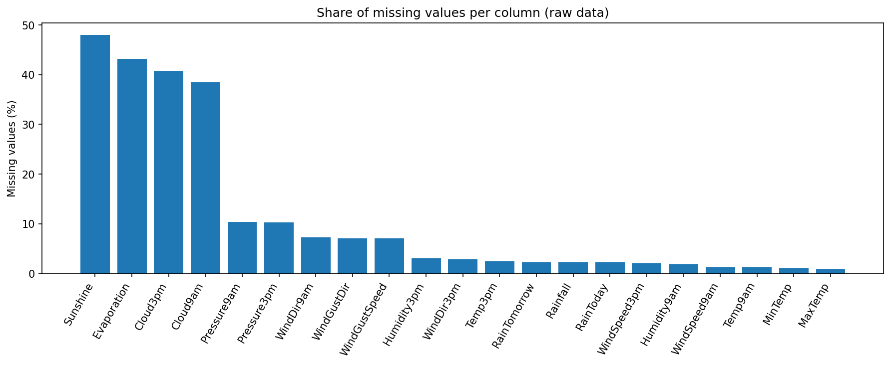

## Headline results

| | |
|---|---|
| **Best model** | Gradient boosting on raw features (native missing-value handling) |
| **ROC-AUC** (held-out 2016 to mid-2017) | **0.885**, versus 0.650 for "tomorrow = today" and 0.500 for chance |
| **Rain recall** | **79%**: catches 2,413 of the 3,038 rainy days in the test period |
| **Rain precision** | 56%: about 44% of rain forecasts are false alarms |
| **F1 (rain class)** | 0.655, versus 0.461 for persistence |
| **Accuracy** | 80.7%, versus 77.0% for always predicting "no rain" (see below for why accuracy is the wrong yardstick here) |
| **Data kept** | 25 of 49 stations, 75,323 labelled rows (52% of the raw rows) |
| **KNN imputation vs. mean fill** | Median 40% lower error on hidden values, but **no gain in the final model** |

The evaluation uses a **time-ordered split**: train on days before 1 January 2016 (62,133 rows), test on 1 January 2016 to 25 June 2017 (13,190 rows). Nothing from the test period is used for imputation, scaling or training.

---

## Part 1: Where and when is data missing?

### The data
23 columns: 16 numeric measurements (temperature, rainfall, evaporation, sunshine, wind, humidity, pressure, cloud) and 7 text columns (date, station, wind directions, `RainToday`, and the target `RainTomorrow`). 21 of 23 columns have gaps.

| Column | Missing |
|---|---|
| `Sunshine` | **48.0%** |
| `Evaporation` | **43.2%** |
| `Cloud3pm` / `Cloud9am` | **40.8%** / **38.4%** |
| `Pressure9am` / `Pressure3pm` | 10.4% / 10.3% |
| Everything else | under 8% |

### The gaps are concentrated in specific stations
Each cell below is the percentage of a station's records missing for one feature. The bright yellow blocks are stations that **never recorded** that instrument.

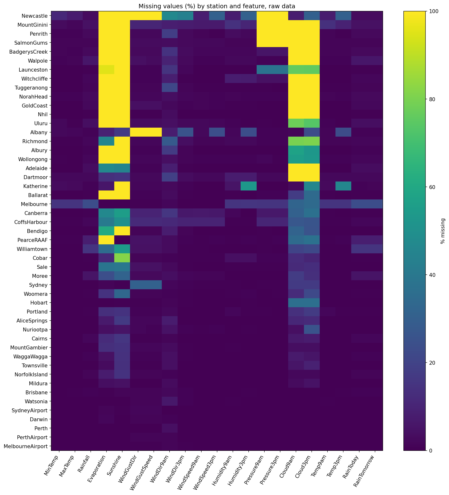

Examples: 16 stations have no `Evaporation` data at all, and many report `Sunshine` only patchily or never.

| Evaporation by station | Sunshine by station |
|---|---|
| 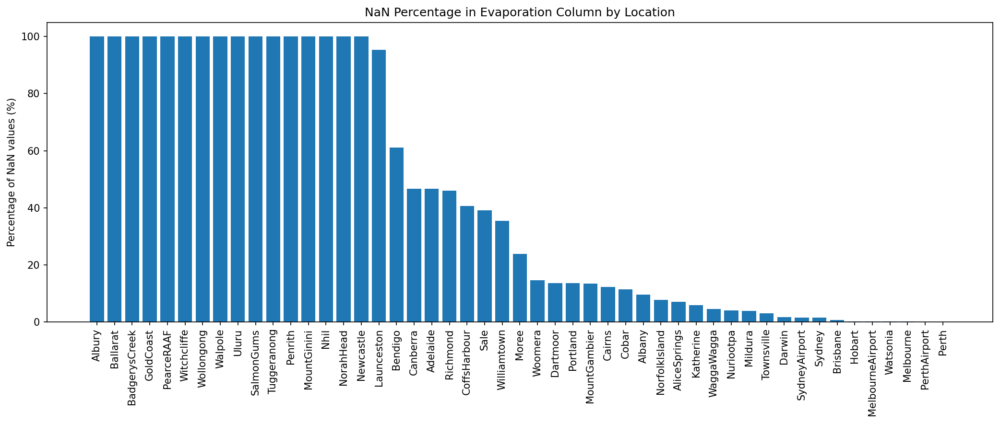 | 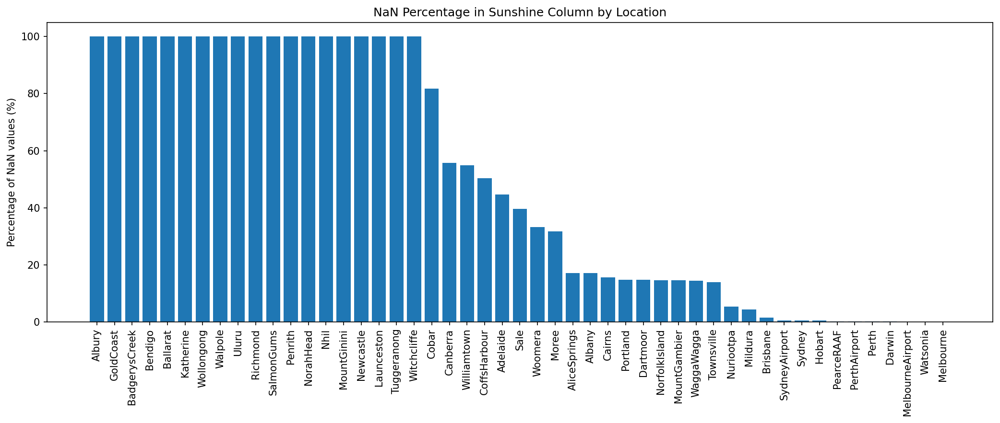 |

### The gaps are not random in time either
Plotting a missing/present indicator over time for Canberra shows entire instruments switching off. **Canberra's evaporation record stops in mid-2013 and its sunshine record at the end of 2012, and neither ever returns** (the data runs to June 2017).

| Evaporation | Sunshine |
|---|---|
| 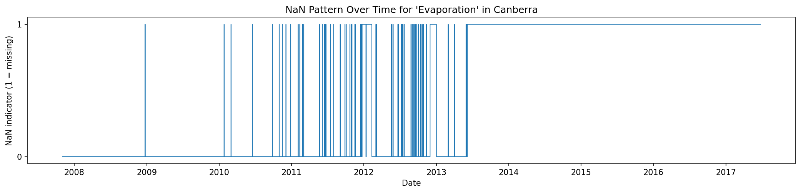 | 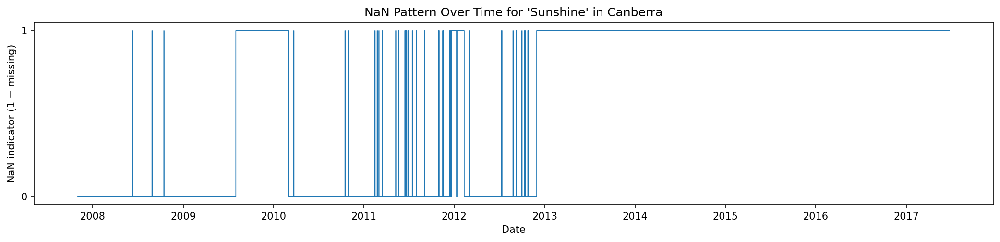 |

This matters twice: it makes imputation harder (no nearby days exist to learn from), and it means "missing" can itself carry information about the station and period.

---

## Part 2: Cleaning

### Step 1: Drop stations with unusable records
A station is removed if **any** column is missing more than 80% of the time. That removes **24 of 49 stations**: Adelaide, Albany, Albury, BadgerysCreek, Ballarat, Bendigo, Cobar, Dartmoor, GoldCoast, Katherine, Launceston, MountGinini, Newcastle, Nhil, NorahHead, PearceRAAF, Penrith, Richmond, SalmonGums, Tuggeranong, Uluru, Walpole, Witchcliffe and Wollongong.

This is a real trade-off: it discards **47% of the rows** (145,460 to 77,031), in exchange for far more trustworthy data. Overall missing rates for the worst columns fall from 38 to 48% to roughly 10 to 15%:

| Column | Missing before | Missing after |
|---|---|---|
| `Sunshine` | 48.0% | 14.6% |
| `Evaporation` | 43.2% | 10.6% |
| `Cloud3pm` | 40.8% | 11.6% |
| `Cloud9am` | 38.4% | 9.7% |

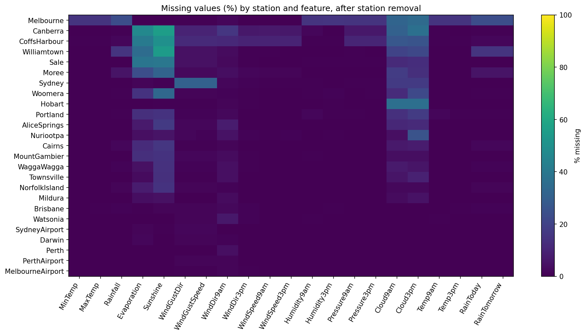

The worst remaining stations are Canberra, Williamtown and CoffsHarbour:

| Evaporation (after) | Sunshine (after) |
|---|---|
| 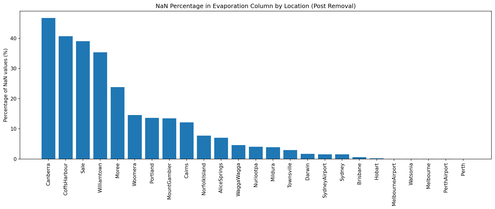 | 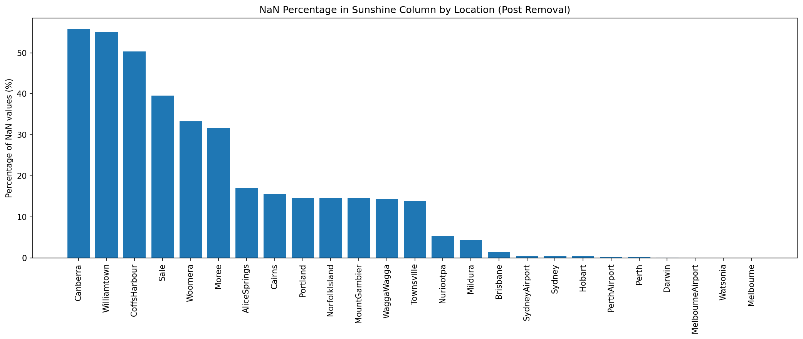 |

### Step 2: Never invent the target
1,708 rows have no `RainTomorrow` label. They are **dropped, not filled**, since a model trained on made-up labels learns nothing true. That leaves 75,323 rows, of which **22.2% are rainy days**, so the classes are imbalanced.

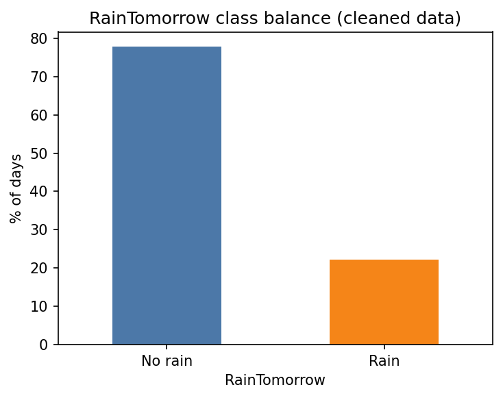

### Step 3: Impute numeric features with KNN
Features are standardized (KNN is distance-based) and each gap is filled from the 5 most similar days (distance-weighted, NaN-aware Euclidean distance). Values are clipped to the observed range and cloud cover is rounded to whole oktas. **0 missing numeric values remain**, and the means barely move (largest shift: 1.3% for `Cloud3pm`).

**Does it work?** A hold-out test hid 5% of known values, imputed them, and compared against simply filling with the column mean:

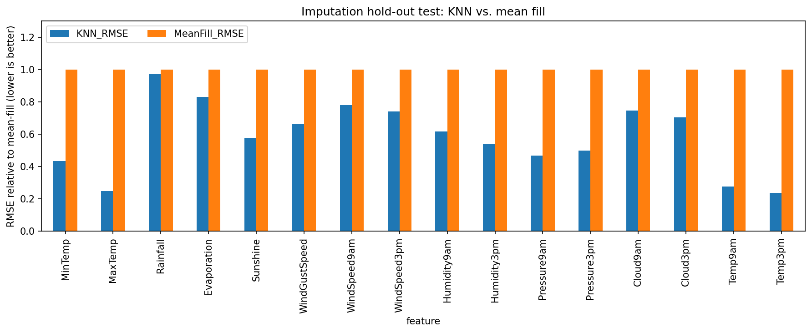

| Feature | KNN error (RMSE) | Mean-fill error | Improvement |
|---|---|---|---|
| `MaxTemp` | 1.70 | 6.89 | **75%** |
| `Temp3pm` | 1.59 | 6.70 | **76%** |
| `Pressure9am` | 3.25 | 6.94 | 53% |
| `Humidity3pm` | 11.0 | 20.5 | 46% |
| `Sunshine` | 2.14 | 3.70 | 42% |
| `Evaporation` | 3.92 | 4.73 | 17% |
| `Rainfall` | 9.76 | 10.04 | **3%** |

Median improvement across all 16 features: **40%**. Temperatures and pressure are well predicted by neighbouring variables; rainfall is essentially unpredictable from other columns. **Caveat:** this test hides values at random, whereas real gaps are long blackouts like Canberra's, so real-world imputation quality on those stretches will be lower than shown.

### Step 4: Categorical features
* **Wind directions** (16 compass points) are encoded as `sin`/`cos` of the bearing, because they are circular (N is adjacent to NNW) and arbitrary integer codes would break that.
* **Gaps** are filled from the same station's most recent earlier reading, never from another station or from the future.
* **`RainToday`** is derived from rainfall (the dataset defines it as at least 1 mm).
* **Seasonality** is added as `sin`/`cos` of the day of year, and stations are one-hot encoded.

---

## Part 3: Modeling

Five approaches, all scored on the same held-out period at a 0.5 threshold:

| Model | Accuracy | Precision | Recall | F1 | ROC-AUC | PR-AUC |
|---|---|---|---|---|---|---|
| Always predict "no rain" | 0.770 | 0.000 | 0.000 | 0.000 | 0.500 | 0.230 |
| Persistence (tomorrow = today) | 0.745 | 0.449 | 0.474 | 0.461 | 0.650 | 0.334 |
| Logistic regression (KNN-imputed) | 0.790 | 0.530 | 0.786 | 0.633 | 0.869 | 0.699 |
| Gradient boosting (KNN-imputed) | 0.800 | 0.544 | **0.805** | 0.649 | 0.883 | 0.734 |
| **Gradient boosting (raw NaNs, no imputation)** | **0.807** | **0.557** | 0.794 | **0.655** | **0.885** | **0.735** |

The models use class weighting to counter the 78/22 imbalance, which is why recall is high and precision modest.

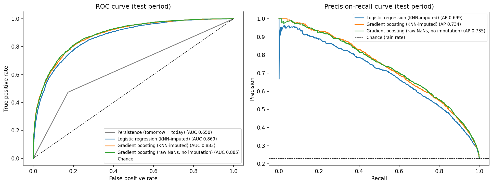

### What the results say
1. **Accuracy is misleading here.** Always predicting "no rain" is right 77% of the time and never catches a single rainy day. The best model is only 3.8 points more accurate by that measure, yet it detects 79% of rain days. Recall, F1 and AUC show the real gain.
2. **The model beats the obvious baseline by a wide margin.** "Tomorrow = today" scores 0.65 AUC. Learning from humidity, pressure, sunshine and wind lifts that to 0.885.
3. **Gradient boosting beats logistic regression** (0.885 vs 0.869 AUC), suggesting non-linear interactions between the weather variables matter.
4. **KNN imputation did not improve prediction.** Gradient boosting reading the raw gaps scored marginally higher (0.885) than the same model on KNN-imputed data (0.883). The difference is small, from a single split, and should not be over-interpreted, but the honest conclusion is that imputation bought nothing here. A plausible reason (not tested) is that missingness is itself informative, as with Canberra's instruments switching off, and imputing hides that signal.

### Error breakdown
Of 13,190 test days, the best model produced:

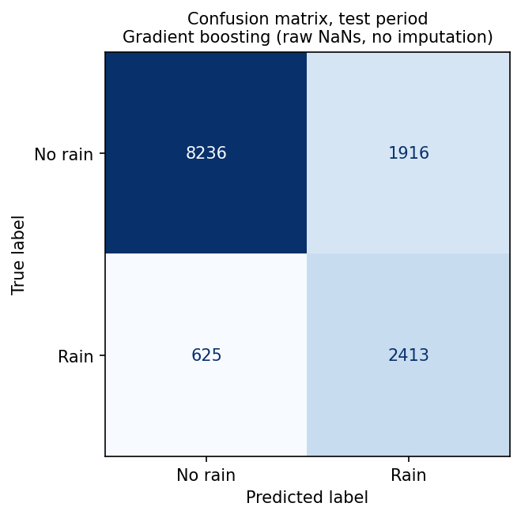

* 2,413 rainy days correctly predicted and 625 missed (79% recall)
* 8,236 dry days correctly predicted and 1,916 false alarms (81% of dry days correctly called)

### What drives the predictions?
Shuffling a feature and measuring how much ROC-AUC drops shows which inputs the model relies on:

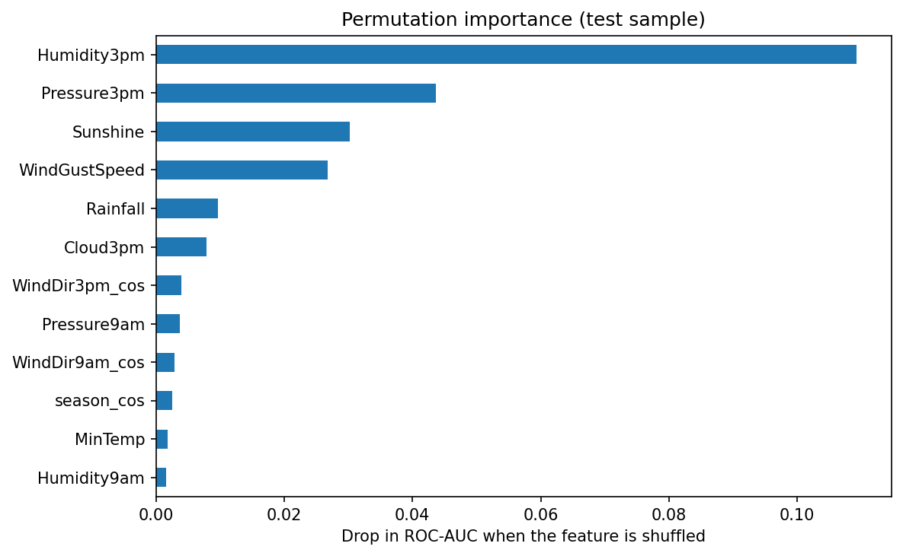

**Afternoon humidity** dominates (a 0.109 AUC drop), followed by afternoon pressure (0.044), sunshine hours (0.030) and wind gust speed (0.027). That matches meteorological intuition: humid air, falling pressure and little sunshine precede rain. Sunshine ranks third despite being 15% imputed, so the cleaned stations were worth keeping.

---

## Limitations
* **Single train/test split, no hyperparameter tuning, no confidence intervals.** Small gaps between models, such as the two gradient boosting variants, are within what noise could produce.
* **Test period is ~18 months.** Results may not hold across other years or climates.
* **Half the stations were dropped**, so conclusions apply to the 25 well-instrumented ones. Behaviour on sparse stations is unknown.
* **Threshold fixed at 0.5.** A deployment would choose it based on the relative cost of a missed rain day versus a false alarm.
* **The imputation hold-out test used random gaps**, which is easier than the long blackouts found in the real data.

## Possible extensions
Time-aware cross-validation and hyperparameter search · threshold tuning for a chosen cost trade-off · lagged features (pressure change over the last day, 3-day rainfall) · per-station error analysis · calibration of predicted probabilities.

## Run it yourself

```bash
git clone https://github.com/crs4293/crs4293.github.io.git && cd crs4293.github.io
pip install -r Projects/ML-AusRain/requirements.txt
# download weatherAUS.csv from Kaggle ("Rain in Australia") into Projects/ML-AusRain/
jupyter notebook Projects/ML-AusRain/notebooks/AustraliaWeatherDatasetMLproject.ipynb
```

The whole notebook runs in a few minutes on a laptop. Set the `WEATHER_CSV` environment variable if the CSV lives elsewhere (in Google Colab the notebook mounts Drive and looks in `Colab Notebooks`). Set `SHOW_ALL_FEATURE_PLOTS = True` in the first code cell for one plot per feature. The notebook also writes the cleaned dataset to `data/` and all metrics to `results/`.

## Repository structure

```
├── notebooks/AustraliaWeatherDatasetMLproject.ipynb   # full analysis, executed with outputs
├── results/         # model_comparison.csv, imputation_validation.csv, feature_importance.csv, summary JSON
├── images/          # figures used in this README
├── requirements.txt
├── README.md
├── notebooks/
    └── AustraliaWeatherDatasetMLproject.ipynb

```

## Tech stack
Python · pandas · NumPy · scikit-learn (`KNNImputer`, `HistGradientBoostingClassifier`, `LogisticRegression`, permutation importance) · Matplotlib · Jupyter

## Data
Daily weather observations from the Australian Bureau of Meteorology (Copyright Commonwealth of Australia), distributed on Kaggle as *Rain in Australia* (`weatherAUS.csv`). The data file is not included in this repository.
