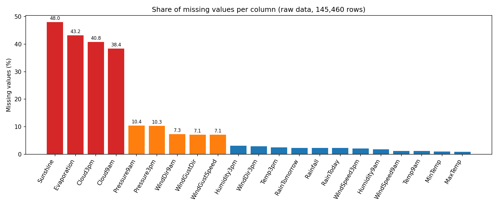
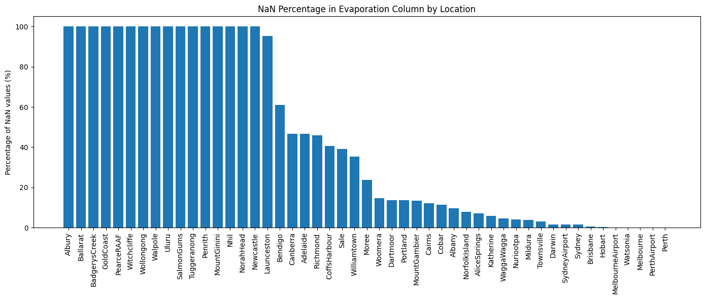
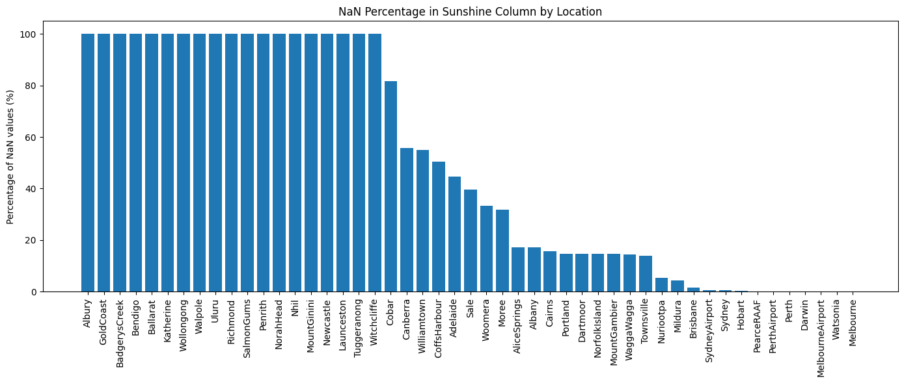
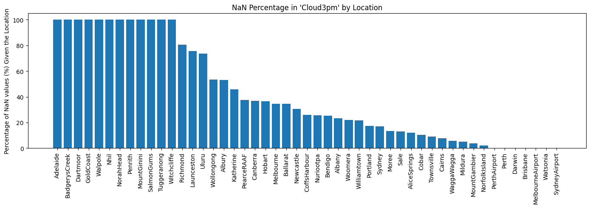
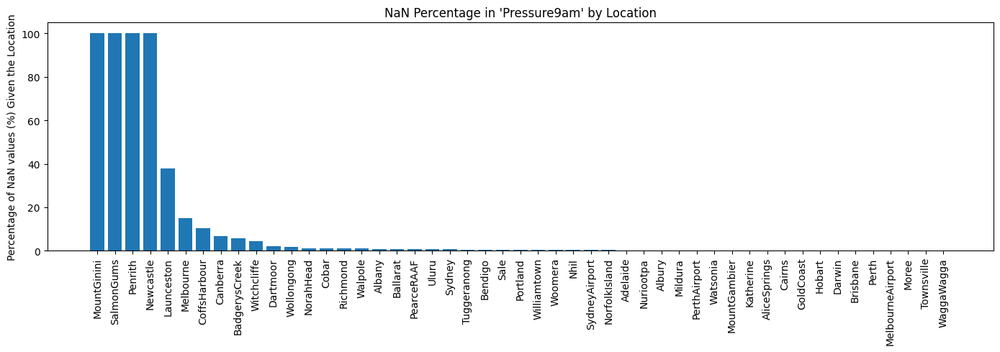
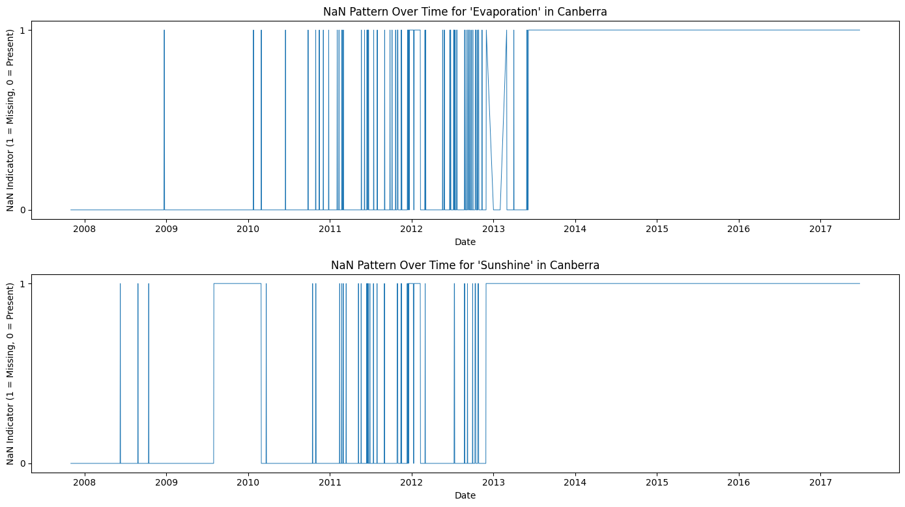
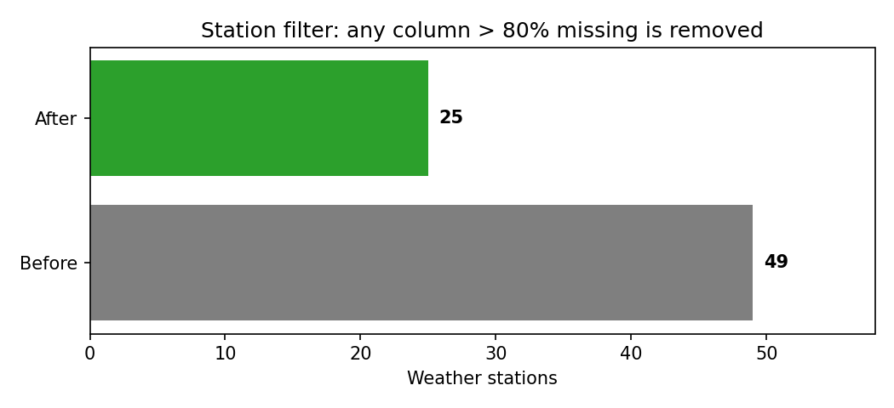
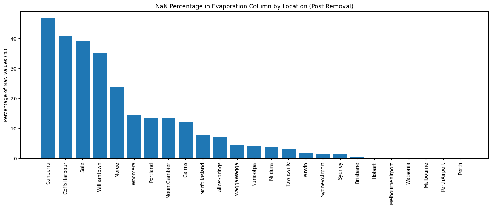
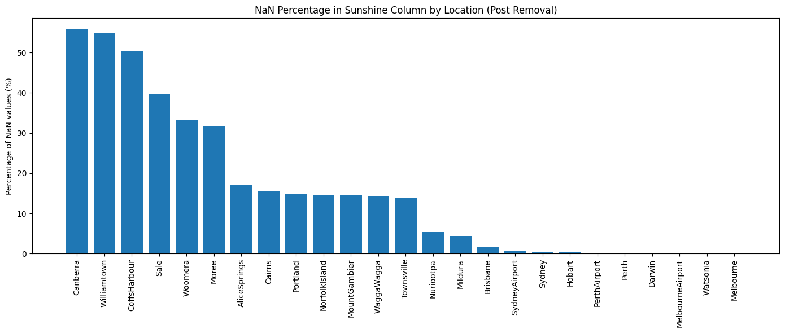

# 🌦️ Australia Weather: Missing-Data Analysis & Preprocessing Pipeline

A data-preparation project for **next-day rain prediction** on the *Rain in Australia* dataset (daily observations from 49 Australian weather stations, ending mid-2017). The raw data is 145,460 rows with large, uneven gaps. This project diagnoses **where and when** values are missing, removes unreliable stations, imputes the rest with KNN, and produces a clean, fully numeric table ready for modeling `RainTomorrow`.



## Key results

| Metric | Value |
|---|---|
| Raw dataset | **145,460 rows × 23 columns**, 49 stations |
| Columns with missing values | 21 of 23 (only `Date` and `Location` are complete) |
| Worst columns (raw) | `Sunshine` 48.0% · `Evaporation` 43.2% · `Cloud3pm` 40.8% · `Cloud9am` 38.4% |
| Stations removed (any column > 80% missing) | **24 of 49** |
| Stations kept | **25** |
| Numeric features imputed | 16 |
| Missing numeric values after KNN imputation | **0** |

## What the project does, step by step

### 1. Profile the data
Loads the CSV, parses dates, and checks types: 16 numeric columns and 7 text columns (`Date`, `Location`, three wind-direction columns, `RainToday`, `RainTomorrow`). Missing percentages are computed per column. Almost every column has some gaps, but four stand out at 38 to 48%, and the two pressure columns sit around 10%. The temperature, humidity and wind-speed columns are under about 3%.

### 2. Find out *where* data is missing
Missingness is concentrated in particular stations, not spread evenly. For example, **16 stations have no `Evaporation` data at all**, and `Launceston` is missing about 95% of it.

| Evaporation | Sunshine |
|---|---|
|  |  |

The same pattern holds for other features. **12 stations never report `Cloud3pm`**, and **4 never report `Pressure9am`**.

| Cloud3pm | Pressure9am |
|---|---|
|  |  |

### 3. Find out *when* data is missing
Plotting a missing/present indicator over time for Canberra shows the gaps are **not random**. Canberra's evaporation record stops around 2013 and sunshine around the same time, and neither returns through the end of the data. A whole instrument stopped reporting, which has real consequences for imputation: there are no nearby observations in time to interpolate from.



### 4. Remove stations that can't be trusted
A station is dropped if **any** column is missing more than 80% of the time. Imputing a column that is almost entirely empty means the model would learn from invented numbers rather than measurements.



**Removed (24):** Adelaide, Albany, Albury, BadgerysCreek, Ballarat, Bendigo, Cobar, Dartmoor, GoldCoast, Katherine, Launceston, MountGinini, Newcastle, Nhil, NorahHead, PearceRAAF, Penrith, Richmond, SalmonGums, Tuggeranong, Uluru, Walpole, Witchcliffe, Wollongong.

After filtering, the worst remaining gaps are in Canberra (roughly 47% of `Evaporation` and 56% of `Sunshine`), Williamtown and CoffsHarbour. These are far less extreme than before, but still large enough to flag.

| Evaporation (after) | Sunshine (after) |
|---|---|
|  |  |

### 5. Impute the numeric features (KNN)
* Features are **standardized** first, because KNN is distance-based and an unscaled column like `Pressure` would dominate.
* Each gap is filled from the **5 most similar days** (`KNNImputer`, distance-weighted, `nan_euclidean` metric), then converted back to original units.
* Imputed values are clipped to the observed min/max, and cloud cover (measured in whole oktas) is rounded to integers.
* **Result: 0 missing numeric values remain.**

### 6. Handle categoricals and the target
* **Wind directions** are filled forward/backward *within each station* in date order, so a station never borrows another station's wind. They are then encoded as `sin`/`cos` of the compass bearing, because directions are circular (N is adjacent to NNW) and arbitrary integer codes would hide that.
* **`RainToday`** is derived from imputed rainfall where missing (the dataset defines it as at least 1 mm).
* **`RainTomorrow`**, the prediction target, is **never imputed**. Rows without a label are dropped.
* **`Location`** is label-encoded, with the mapping saved to `results/location_encoding.json`.

### 7. Validate and export
The notebook asserts that no NaNs remain, compares means and standard deviations before and after imputation, and runs a **hold-out test**: it hides 5% of known values, imputes them, and compares KNN against simple mean-fill using MAE and RMSE. Everything is saved for reuse:

| Output | Contents |
|---|---|
| `data/weatherAUS_cleaned.csv` | Model-ready dataset |
| `results/preprocessing_summary.json` | Row counts, stations removed, missing %, class balance |
| `results/imputation_validation.csv` | KNN vs. mean-fill error per feature |
| `results/imputation_distribution_check.csv` | Mean/std before vs. after imputation |
| `images/` | All figures above |

## Design decisions worth noting

| Decision | Why |
|---|---|
| Drop stations rather than impute them | A column that is 80%+ empty gives KNN almost nothing real to learn from |
| Drop unlabeled rows instead of filling `RainTomorrow` | Inventing the target would contaminate any model trained on it |
| Per-station wind filling | Filling across rows would copy one station's wind into another |
| `sin`/`cos` wind encoding | Preserves the circular structure of compass directions |
| KNN instead of mean fill | Uses correlated variables (e.g. `Temp9am` informs `MinTemp`), and the hold-out test measures whether that helps |

## Limitations and next steps
* This repository covers **data preparation and analysis only**. No predictive model is trained yet, so there are no accuracy figures to report.
* The imputer and scaler currently see the full dataset. Before modeling, fit them on the **training split only** (for example inside an sklearn `Pipeline`) to avoid leakage.
* Because Canberra-style gaps are long, contiguous blackouts, KNN fills them from other days' similar weather rather than from real local readings. Treat `Evaporation` and `Sunshine` for those stations with caution.
* Planned: time-ordered train/test split, a baseline classifier compared against "always predict no rain", evaluated with recall, F1 and ROC-AUC rather than accuracy because the classes are imbalanced.

## Run it yourself

```bash
git clone <your-repo-url> && cd <your-repo>
pip install -r requirements.txt
# download weatherAUS.csv from Kaggle ("Rain in Australia") into the repo root
jupyter notebook notebooks/AustraliaWeatherDatasetMLproject.ipynb
```

* Set the `WEATHER_CSV` environment variable if the CSV lives elsewhere. In Google Colab, the notebook mounts Drive and looks in `Colab Notebooks`.
* Set `SHOW_ALL_FEATURE_PLOTS = True` in the first code cell for one plot per feature (about 40 extra figures).

## Repository structure

```
├── notebooks/AustraliaWeatherDatasetMLproject.ipynb
├── images/          # figures used in this README
├── requirements.txt
└── README.md
```
`data/` and `results/` are created when the notebook runs.

## Tech stack
Python · pandas · NumPy · scikit-learn (`KNNImputer`, `StandardScaler`, `LabelEncoder`) · Matplotlib · Jupyter

## Data
Daily weather observations from the Australian Bureau of Meteorology, distributed on Kaggle as *Rain in Australia* (`weatherAUS.csv`). The data file is not included in this repository.
