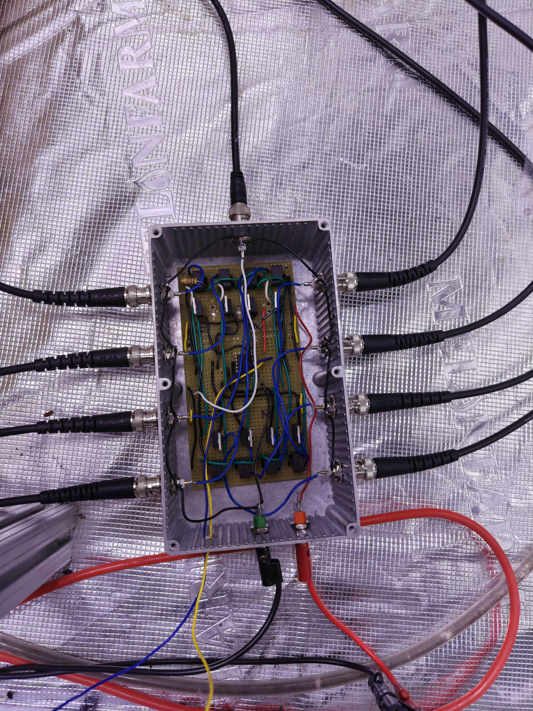

# Project Portfolio

Hi, I'm **Callum Serbetci**, a Computer & Electrical Engineering and Mathematics student at Rutgers University.

I am interested in **embedded systems, FPGA development, machine learning, software development.

This repository contains a collection of some of my engineering, software, and personal projects.

---

# About Me

- **University:** Rutgers University
- **Major:** Computer & Electrical Engineering
- **Additional Major:** Mathematics
- **Interests:** Machine Learning, Signal Processing, Embedded Systems, Computer Vision, FPGA Development, Software Engineering
- **GitHub:** [github.com/crs4293](https://github.com/crs4293)

---

# Projects

## 1. Electrospray Spraying Mode Classification

**Project Type:** Machine Learning / Signal Processing / Research

**Technologies:** Python, NumPy, SciPy, Pandas, Scikit-learn, Matplotlib, PyWavelets

### Overview

This project uses electrical current measurements from an electrospray system to classify different spraying modes using machine learning.
The system processes raw sensor data, extracts signal-processing features, and uses a machine-learning model to predict the spraying mode.

### Problem

The research lab was only measuring current of a single electrospray setup due to the cost of the nano-amp current sensor whilst the spray had multiple setups running in parralel, menaing only one plant data could be recorded at a time. Additionally there was no strong classifier able to determine the spraying mode of the setup, leading to many of the targets not receiving any solution.

### Approach

The project follows the following pipeline:


```text
Analog Signal Multiplexer
        │
        ▼
Raw Current Signal
        │
        ▼
Signal Preprocessing
        │
        ▼
Feature Extraction
        │
        ├── Statistical Features
        ├── Frequency-Domain Features
        ├── STFT Features
        └── Wavelet Features
        │
        ▼
Machine Learning Model
        │
        ▼
Predicted Spraying Mode# Project Portfolio

## Getting Started

### Convolutional Neural Network on FPGA

* VHDL, ML, Zybo Z7


### Installing

* How/where to download your program
* Any modifications needed to be made to files/folders

### Executing program

* How to run the program
* Step-by-step bullets
```
code blocks for commands
```

## Help

Any advise for common problems or issues.
```
command to run if program contains helper info
```


## Authors

Contributors names and contact info

ex. Dominique Pizzie


## Version History

* 0.2
    * Various bug fixes and optimizations
    * See [commit change]() or See [release history]()
* 0.1
    * Initial Release

## License

This project is licensed under the [NAME HERE] License - see the LICENSE.md file for details

## Acknowledgments

Inspiration, code snippets, etc.
